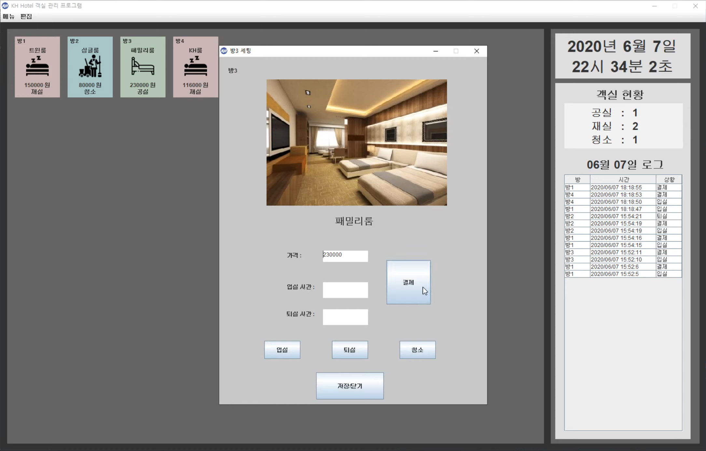

# 자바 미니 프로젝트

# 호텔 객실 관리 프로그램

## 개요

### 사용 목적

숙박업소를 관리하시는 업주분들이 업무에 필요한 모든 기록 장부를 수기로 작성하지 않고, 컴퓨터를 사용하여 편하게 이용하실 수 있도록 만든 프로그램입니다.

### 사용한 언어

Java와, Java의 GUI 라이브러리 Swing을 사용했습니다.

### 구성

File을 통해 데이터를 저장하고 불러오는 형태로 프로그램을 구성 했습니다.

### 사진

## 부가설명

### 개발기간

2020/06/01 ~ 2020/06/07

### 만든 사람들

김원식, 이장송, 남보람

### 발표 링크

[호텔 객실 관리 프로그램](https://www.youtube.com/watch?v=ASL61InKPk0&list=PL50WLqESoTXc62406yrx0i0RWn-rCYSdv&index=1)
